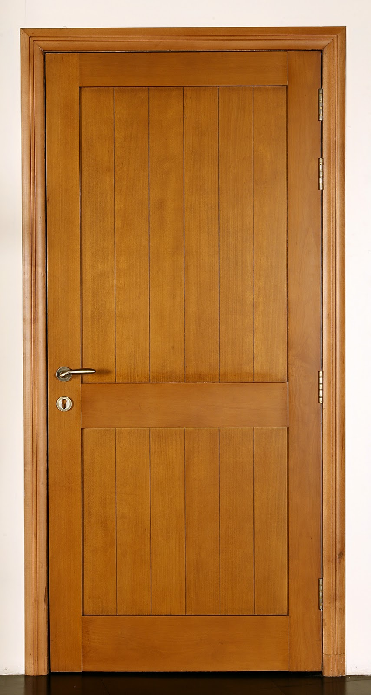

<!-- ok it needs to be like homes-
    
1. changing fonts text
- which fonts
-js to animate?
2. moving roof to house
-make a gif or js?
3. opening door upon hover
- door asset?
5. running gif
6. background img
- fill to overflow
 -->

<!DOCTYPE html>

<html>
    <head>
        <!-- <meta charset="utf-8" />
        <meta name="viewport" content="width=device-width" />

        <title>writinghome</title>

        <link rel="icon" href="styles/assets/spider.gif" type="image/x-icon" /> -->

        
    </head>

    <body>
        

            <!-- <canvas id="background" ></canvas> -->
            

                

                    <h1>
                        RUN
                    </h1>
                    
    
                

            

        

<!-- 
         -->

        <footer id="footer-sec"></footer>
    </body>
</html>

also here are some borders

            #border {
                border-image:  url("data:image/png;base64,iVBORw0KGgoAAAANSUhEUgAAAFQAAABUCAYAAAAcaxDBAAAB6ElEQVR4Xu2dwVGEUBQEJSGDMC3PpmUQJqRXYK3tmnIeAtWe1pq/U9DMG74ccPn6ePt+Wf28vn8u699JX6+942c6/72+pF/YA78jxCRQAg0TkAbOhALgGChdsL0hrb+7TpW3uQH9BkOgWyoCLY+MQI8Gmo40XaHy8f+7Xcrn4S5PZyDQ54QEGm6bKHACbQPd+6UbWbpiV9fTZxsP+1CBPt93Eh+BwgiZ0HLHHA70btsoGmnS/zzyAt0+kBforiIogaQLVKDlu45ABTpLoOxOHUm6HerIlyMpUIHOEii7U0eSboc68uVIClSgswTK7tSRpNuhjnw5kgIV6CyBsjt1JOl2qCNfjqRABTpLoOxOHUm6HerIlyMpUIHOEii7U0eSboc68uVIClSgswTK7tSRpNuhjnw5kgIV6CyBsjt1JOl2qCNfjqRABTpLoOxOHUm6HerIlyMpUIHOEii7U0eSboc68uVIClSgswTK7tSRpNuhjnw5kgIV6CyBsjt1JOl26NlGvhyQ09kd/hKX0xEoH5BABVomULaLE5q+H/NurxUi/ikf384IRAVKkQt1gYbAaHkMtG1IflfX6R7ie+zDKyzQEBgtFygRCnUESk9PSA+P53LL6fz3uv+tJtyH0l9OAhXosa2RjvwPzppqEXyFoqgAAAAASUVORK5CYII=") 28 /  28px / 0 round;
                border-width:  28px;
                border-style:  solid;
                margin: 50px;
                margin-left: 500px;
            }

            #border2 {
                border-image:  url("data:image/png;base64,iVBORw0KGgoAAAANSUhEUgAAAFQAAABUCAYAAAAcaxDBAAAB6UlEQVR4Xu2dwVGEUBQEJSwDMArjMwoDMCy9Amtt15TzEKj2tNb8nYJm3vDlgMvH59f3y+rn/e11Wf9O+nrtHT/T+e/1Jf3CHvgdISaBEmiYgDRwJhQAx0Dpgu0Naf3ddaq8zQ3oNxgC3VIRaHlkBHo00HSk6QqVj//f7VI+D3d5OgOBPick0HDbRIETaBvo3i/dyNIVu7qePtt42IcK9Pm+k/gIFEbIhJY75nCgd9tG0UiT/ueRF+j2gbxAdxVBCSRdoAIt33UEKtBZAmV36kjS7VBHvhxJgQp0lkDZnTqSdDvUkS9HUqACnSVQdqeOJN0OdeTLkRSoQGcJlN2pI0m3Qx35ciQFKtBZAmV36kjS7VBHvhxJgQp0lkDZnTqSdDvUkS9HUqACnSVQdqeOJN0OdeTLkRSoQGcJlN2pI0m3Qx35ciQFKtBZAmV36kjS7VBHvhxJgQp0lkDZnTqSdDvUkS9HUqACnSVQdqeOJN0OdeTLkRSoQGcJlN2pI0m3Q8828uWAnM7u8Je4nI5A+YAEKtAygbJdnND0/Zh3e60Q8U/5+HZGICpQilyoCzQERstjoG1D8ru6TvcQ32MfXmGBhsBouUCJUKgjUHp6Qnp4PJdbTue/1/1vNeE+lP5yEqhAj22NdOR/ABuBcvFlgM1/AAAAAElFTkSuQmCC") 28 /  28px / 0 round;
                border-width:  28px;
                border-style:  solid;
                background-color: rgb(138, 43, 226, 0.6);
                margin: 50px;
                margin-left: 500px;
                padding: 20px;
            }

            #border3 {
                border-image:  url("data:image/png;base64,iVBORw0KGgoAAAANSUhEUgAAAFQAAABUCAYAAAAcaxDBAAAB5klEQVR4Xu2dQW6DUBQDy6YX6P2P2At0k26BVBlZ8aOApqtU/rFg8DO/LOjy/fh5fKx+vpbPZf076eu1d/xM57/Xl/QLe+B3hJgESqBhAtLAmVAAHAOlC7Y3pPV316nyNjegv2AIdEtFoOWREejRQNORpitUPv5/t0v5PN3l6QwE+pqQQMNtEwVOoG2ge790I0tX7Op6+mzjaR8q0Nf7TuIjUBghE1rumMOB3m0bRSNN+tsjL9DtA3mB7iqCEki6QAVavusIVKCzBMru1JGk26GOfDmSAhXoLIGyO3Uk6XaoI1+OpEAFOkug7E4dSbod6siXIylQgc4SKLtTR5Juhzry5UgKVKCzBMru1JGk26GOfDmSAhXoLIGyO3Uk6XaoI1+OpEAFOkug7E4dSbod6siXIylQgc4SKLtTR5Juhzry5UgKVKCzBMru1JGk26GOfDmSAhXoLIGyO3Uk6XaoI1+OpEAFOkug7E4dSbod6siXIylQgc4SKLtTR5Juh55t5MsBOZ3d4S9xOR2B8gEJVKBlAmW7OKHp+zHv9loh4p/y8e2MQFSgFLlQF2gIjJbHQNuG5Hd1ne4hvsc+vMICDYHRcoESoVBHoPT0hPTweC63nM5/r/vfasJ9KP3lJFCBHtsa6cj/An2DfuGfbNGbAAAAAElFTkSuQmCC") 28 /  28px / 0 round;
                border-width:  28px;
                border-style:  solid;
            }

            #border4 {
                border-image:  url("data:image/png;base64,iVBORw0KGgoAAAANSUhEUgAAAFQAAABUCAYAAAAcaxDBAAACUElEQVR4Xu2cS27DMAwFm/sfujW6imVADwPSiQyNtxL1GT5KpJ329Xs8Pz5tBF4CbWP5P5BAe3kKtJlnBvo6nvdJxyOCto8bqI6X7O+ebxw/hjwF9u0NjusV6MMiQoUOaWI1AiNQGjLdh/pq41EelzOUDrAagO71UB4CDR4QaLNEy0DTetIEyf5p7bQ0j3no5RYb0pqnAaLrFSglFvoLdDWgNNFtXv9yw6VS+tKODTY/Q6PgBDoPCswHG6jQ+etMfIttDjQd8uahpk1JI73tOIKxgSE/9Vh825QurV49rDda2r95KPSZQCGw1F2giRBsFygElroLNBGC7QKFwFJ3gSZCsL0MNM3nN6U5IWt5a/kUQ73tuDTHBtby1vIVzZYvpfjNZHOFRj7YAwJln0CiBwTKgKbzxjzUPDRpZNqOsyBssHnIJ+9YKd1dKXkpnQnjLAgbbB7yUXACncc85oMNVKh5aLqZZ+04C8IGmys0Oce06e60KXpAhfo+NImEnKGmTRWahy3OgrDB5iGvQlVokUCzOY5gbGDIs0opnhECFWjlFMARbOnJ3jYl51h6WnomjfS24wjGBptfSsld/p0SDPmYBeFbbHOFCjTFqAotEoLmOIK9lMxDocZq3bHgsMHml1Jyj5USvJQw0PT7T6rotIDV2ymPmNiPGxbomcglC0hpgUDP/yU98VCh4cwph/w4fiy1hlu/qvinzXfhlc7Ep20QKwoKIvKKHYoTfnqDn55PhR4KeodQjUAMdPU8cbX14UpptQ2sth6BNntEoM1A/wACY39BEkyGdQAAAABJRU5ErkJggg==") 28 /  28px / 0 round;
                border-width:  28px;
                border-style:  solid;
            }

            #border5 {
                border-image:  url("data:image/png;base64,iVBORw0KGgoAAAANSUhEUgAAAFQAAABUCAYAAAAcaxDBAAACkUlEQVR4Xu2aQZKDMAwEl/8/ejfHYKq2q0sCkTBcNZaltqwYnO3nw5/f1/OewvZ6JlManbwj8QDtoPjmI0CfDvTsClj9r7yne6Jdf+yhAeqQBqjjheoARUROgEDJnW0J0z2T4q3aA3R5EQhQ2kKLvQqMxqdCr65QWhEqkO7xdz+nYoV2A7EH9ekfMSqYwwLTgAAlQnt7KtTxQjUCJQ9UwdZ+dY+08VHLClD4QE3AdQ9NhbobgVTo1RVqS36t6Or46g6h8d12rNAqkOp4Svhs/zS/7qHVgKvjKaGz/dP8AWoJST1ueenv9nJ6la2egwMUSoAO8nrL377kZICpUAmM5AFKhE6221PE43qo5R+glhjoA3QaqF0BirfbH81XtVO89CO2Hqs2cmgD7vZn57d6ijdAJdEAlcBI3g6UJlztFID1N623+ZBen0PJ4TQgO7/Nh/QBClcgdocGaIDaTe30tKXJ2+Mr1G7pACUCiz0VKoGRvB2odWj1lNC0vZrPoYdah1Y/DYzmr+YToGf3ULtCVk8VMm2v5oMVuia4fv+rBnA1wO54D/7oHBag/y95gMpXTdpBAXo1UGoB9q8ptMLfZsd3+e4m/m0AD78xlGCAEqG9PRXqeKEagVJPpRme1nMDlCpC2gNUAiN5gBIhaddApX+Un32KqPq34wMUljxAm79vBujdgdIKkR2bqBSs81U/L3bHjz2UJiS75IXyAEVEThCgjheqPx4oZtgssMBo+mpLsuOxh1LA3fYAbSYaoAG6I4D38vYe3vac6npUK7o73gBtvgUN0ADdN4nbb/lqTzt7fBWgjc/22NudQynhACVC0h6gEhjJA7T5ioGAT9vHe6ht+tPAaP4AJULSHqASGMn/AIJCoHJXz75YAAAAAElFTkSuQmCC") 28 /  28px / 0 round;
                border-width:  28px;
                border-style:  solid;
            }